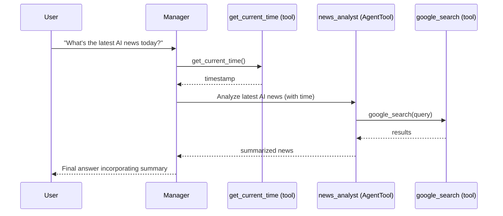

## 7-multi-agent — Onboarding Guide

This guide helps you run, understand, and extend the multi-agent example. It includes architecture diagrams, quickstart steps, and tips for adding new agents.

### What you’ll build
- **Manager** (`manager/root_agent`) that routes requests
- **Sub-agents**: `stock_analyst`, `funny_nerd`
- **Agent-as-a-tool**: `news_analyst` (wrapped with `AgentTool`)
- **Utility tool**: `get_current_time`

```mermaid
graph TD
    U[User] --> M[Manager]
    M -- delegates --> SA[stock_analyst (sub-agent)]
    M -- delegates --> FN[funny_nerd (sub-agent)]
    M -. uses AgentTool .-> NA[news_analyst]
    M -. uses tool .-> T[get_current_time]

    classDef manager fill:#eef,stroke:#557;
    classDef sub fill:#efe,stroke:#575;
    classDef tool fill:#ffe,stroke:#775;

    class M manager;
    class SA,FN sub;
    class NA,T tool;
```

## Project layout
```
7-multi-agent/
├─ README.md
└─ manager/
   ├─ __init__.py                      # imports agent.py
   ├─ agent.py                         # defines root_agent (Manager)
   ├─ sub_agents/
   │  ├─ funny_nerd/agent.py           # sub-agent with a custom tool
   │  ├─ news_analyst/agent.py         # agent used as a tool via AgentTool
   │  └─ stock_analyst/agent.py        # sub-agent using yfinance
   └─ tools/tools.py                   # get_current_time
```

Key files to skim:
- `manager/agent.py` — defines `root_agent` with `sub_agents` and `tools` (AgentTool wrapper for `news_analyst`)
- `manager/sub_agents/funny_nerd/agent.py` — implements a simple tool-driven sub-agent
- `manager/sub_agents/stock_analyst/agent.py` — uses `yfinance` in a tool to fetch prices
- `manager/sub_agents/news_analyst/agent.py` — agent that uses `google_search` (becomes a tool via `AgentTool`)

## Quickstart
1) Activate your virtual environment (from the crash-course root if already created):
```bash
source ../.venv/bin/activate    # macOS/Linux
..\.venv\Scripts\activate.bat  # Windows CMD
..\.venv\Scripts\Activate.ps1  # Windows PowerShell
```

2) Configure your API key in `manager/.env`:
```
GOOGLE_API_KEY=your_key_here
```

3) Run the web UI from `7-multi-agent/`:
```bash
adk web
```

4) Open the URL shown (typically `http://localhost:8000`), choose `manager` from the dropdown, and chat.

### Example prompts
- “Can you tell me about the stock market today?”
- “Tell me a nerdy joke about Python.”
- “What’s the latest AI news today?”
- “What time is it right now?”

## How routing works
- The Manager examines the user’s request and either:
  - **Delegates** to a sub-agent (`stock_analyst`, `funny_nerd`) which fully handles the response, or
  - **Invokes tools** like `AgentTool(news_analyst)` and `get_current_time`, then composes the final answer.



## Constraints and patterns
- **Built-in tools in sub-agents:** Avoid using multiple built-in tools inside sub-agents. If you need them, wrap the agent with `AgentTool` and make it a tool of the Manager.
- **Sub-agent delegation vs Agent-as-a-tool:**
  - Delegation: sub-agent takes over the entire response; Manager acts as a router.
  - Agent-as-a-tool: sub-agent returns a result; Manager integrates it into a composed response.

## Extend the system

### Add a new sub-agent
1) Create `manager/sub_agents/<your_agent>/agent.py` and define an `Agent` instance.
2) In `manager/agent.py`, import and append it to `sub_agents=[...]`.
3) Add instructions and tools (if needed) in the new agent.

### Add an agent as a tool
1) Build the agent normally (it can have its own tools).
2) Wrap it with `AgentTool` in `manager/agent.py`, e.g. `tools=[AgentTool(my_agent), ...]`.

### Add a plain function tool
1) Implement the function in `manager/tools/tools.py`.
2) Add it to `tools=[...]` in `manager/agent.py`.

## Troubleshooting
- The `manager` agent isn’t in the dropdown:
  - Ensure you run `adk web` from `7-multi-agent/`.
  - Check each `__init__.py` imports its `agent.py`.
  - Verify `manager/agent.py` imports all sub-agents and tools.
- Stock price errors: ensure `yfinance` can fetch `currentPrice` for the given ticker.
- News summaries: confirm your `GOOGLE_API_KEY` is set and network access is available.

## References
- ADK Multi-Agent Systems docs: [Multi-agent systems](https://google.github.io/adk-docs/agents/multi-agent-systems/)
- Agent Tools docs: [Agent-as-a-tool](https://google.github.io/adk-docs/tools/function-tools/#3-agent-as-a-tool)


